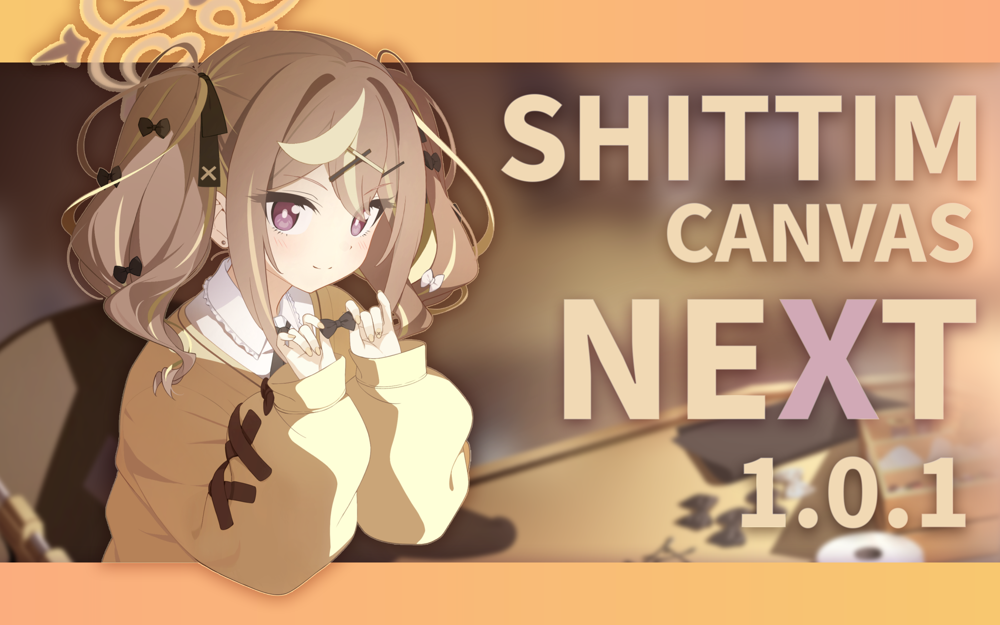

# 欢迎来到 Shittim Canvas NEXT

*本文档 100% 由人类（具体来讲就是一只疏影、或者一只杰帕斯）纯手工书写，包含 0% 的 AI 生成的 Markdown 说明书，请放心阅读。*  
*（Emoji 是我在预览网站一个一个挑的，为了让文档看起来没那么枯燥，结果被说像 AI 了，特此声明）*

## 📌 1. 简介

-   **Shittim Canvas NEXT** 是一款基于 **Unity** 开发的展示型工具软件，可以用作 **桌面壁纸** 或是 **桌宠**，专注于还原《蔚蓝档案》中的平面动态场景内容，包括 **记忆大厅**、**剧情动态背景** 等资源的播放与展示效果。

-   项目的目标是完美复刻游戏内表现，复现原作中的视觉呈现、动画逻辑与交互细节，并在此基础上提供更高的可扩展性与自定义能力。

## ✨ 2. 特性

- ### 🎮 高还原度
    - 还原游戏内记忆大厅与剧情动态背景的整体视觉效果
    - 还原粒子特效、后期处理等视觉层面的表现
    - 还原游戏内播放动画的混合参数与完整逻辑等
    - 还原游戏内响应用户交互的完整逻辑
    - 还原场景的环境音与开场音效等音频层面的表现

- ### 🛠️ 高自定义程度
    - 计划支持导入并自定义 **Spine 4.2** 版本的记忆大厅资源
    - 计划扩展更多非官方的自定义功能
    - 计划支持扩展官方记忆大厅原有的交互形式
    - 计划支持可自定义的交互区域

## 👤 3. 开发者 {#开发者}

<table>
  <tr>
    <td align="center">
      <a href="https://github.com/SparseShadow2024">
        
         
        <b>Sparse Shadow</b>
      </a>
       
      🔧 主要开发者
    </td>
    <td align="center">
      <a href="https://github.com/Japerz12138">
        
         
        <b>Japerz</b>
      </a>
       
      🎨 UI 设计
    </td>
  </tr>
</table>

:::tip 开发者绝赞招募中！

请联系浅草疏影关于加入 Shittim Canvas NEXT 的开发！

:::

## 👤 4. 知识库贡献者 {#知识库贡献者}

<table>
  <tr>
    <td align="center">
      <a href="https://github.com/SparseShadow2024">
        
         
        <b>Sparse Shadow</b>
      </a>
    </td>
    <td align="center">
      <a href="https://github.com/Japerz12138">
        
         
        <b>Japerz</b>
      </a>
    </td>
  </tr>
</table>