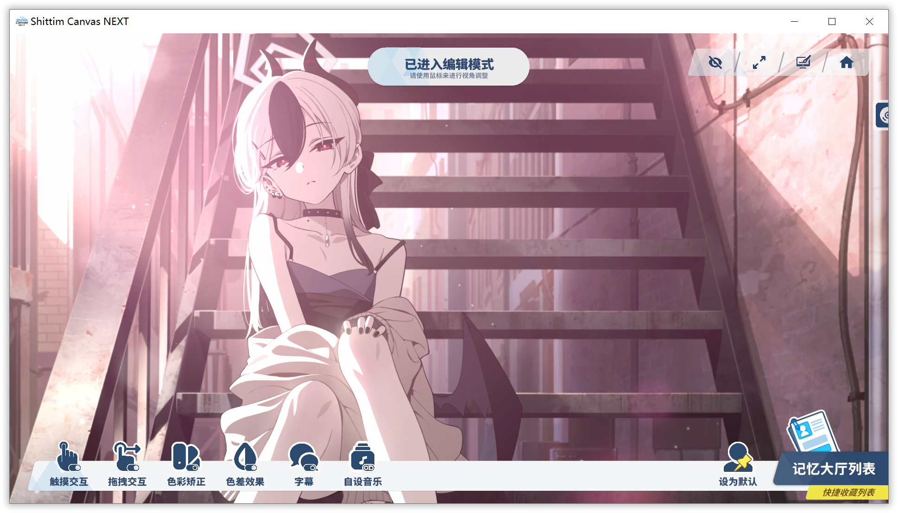

# 编辑模式

  

### 快捷键
- 在 **主页面** 点按快捷键 `Ctrl E` 来进入编辑模式
- 在 **编辑模式** 点按快捷键 `Ctrl E` 来退出编辑模式
- 在 **编辑模式** 点按快捷键 `Ctrl R` 来复原角色变换

### 鼠标手势
- 在 **编辑模式** 点击后拖拽 `鼠标左键` 来移动角色
- 在 **编辑模式** 滚动 `鼠标中键` 来移动旋转角色
- 在 **编辑模式** 点击后拖拽 `鼠标右键` 来缩放角色