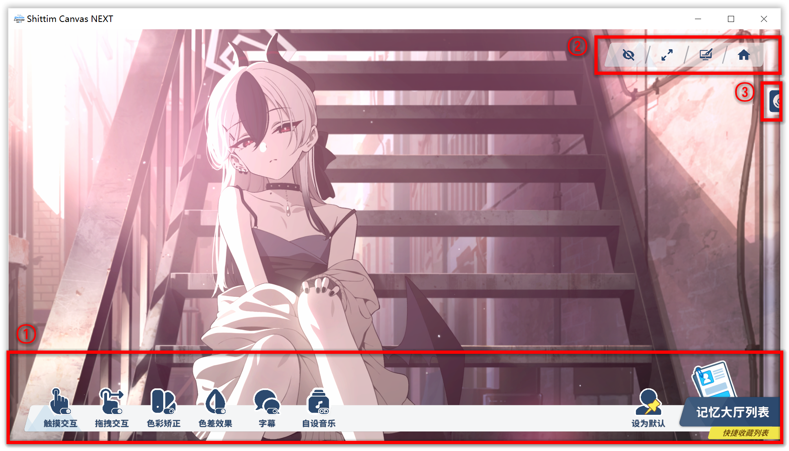

# Main screen overview {#main-screen}

A quick map of what you’re looking at.

  

| # | What |
| --- | --- |
| ① | **[Basic Dock](./基础 Dock 栏.md#basic-dock)** — tweak the active character and toggles. |
| ② | **[Feature Dock](./功能 Dock 栏.md#feature-dock)** — shortcuts to the usual suspects. |
| ③ | **Music player** — spawns the [music player](./音乐播放器.md#music-player). |

:::danger Heads-up

Your build may differ slightly from the screenshots—software moves faster than screenshots.

:::
