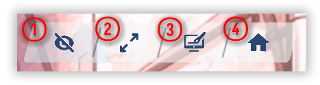

# Feature Dock {#feature-dock}

Top-right controls—HUD, fullscreen, wallpaper, menu.

  

| # | What |
| --- | --- |
| ① | **HUD** — show or hide on-screen UI. |
| ② | **Fullscreen** — borderless immersion (or borderless confusion). |
| ③ | **Wallpaper mode** — send the window to the monitor you’re on; see [Wallpaper mode](./壁纸模式.md#wallpaper-mode). |
| ④ | **Main menu** — opens the main menu. |
