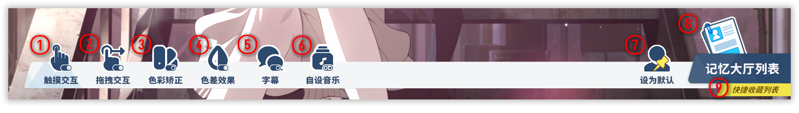
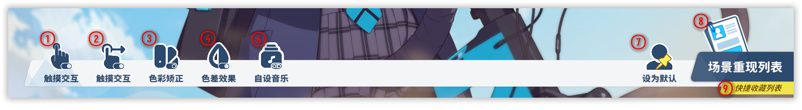

# Basic Dock {#basic-dock}

Per-character switches—Memorial Lobby vs. story background.

- ### Memorial Lobby
    
- ### Story live background
    

| # | What |
| --- | --- |
| ① | **Touch** — enable tap interactions (dialogue, etc.); works in wallpaper mode too. |
| ② | **Drag** — head-pats, gaze follow, special interactions; also in wallpaper mode. |
| ③ | **Color grading** — official-ish color tweaks (wallpaper mode included). |
| ④ | **Chromatic aberration** — that screen fringe look (wallpaper mode included). |
| ⑤ | **Subtitles** — show or hide subtitle text (wallpaper mode included). |
| ⑥ | **Custom BGM** — use your own background music (wallpaper mode included). |
| ⑦ | **Set as default** — make this character the default when you launch or switch to this type. |
| ⑧ | **Character list** — opens [Character selection](./角色选择窗口.md#character-selection). |
| ⑨ | **Favorites** — opens [Character selection](./角色选择窗口.md#character-selection) with favorites filter on. |
