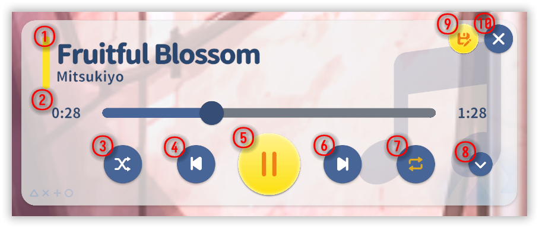
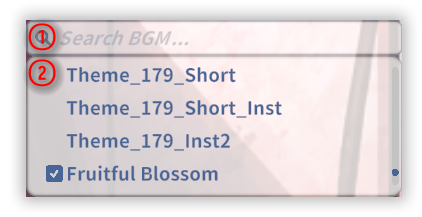

# Music player {#music-player}

Playback controls that actually matter.

## Player

  

| # | What |
| --- | --- |
| ① | **Now playing** — title and artist. |
| ② | **Progress** — where you are in the track. |
| ③ | **Shuffle** — chaos mode for playlists. |
| ④ | **Previous** — per your play policy. |
| ⑤ | **Play / pause** — the universal button. |
| ⑥ | **Next** — per your play policy. |
| ⑦ | **Loop one** — when one song is enough forever. |
| ⑧ | **Playlist** — show or hide the [playlist](#music-playlist) (below). |
| ⑨ | **Set as custom BGM** — bind current track to this character. |
| ⑩ | **Close** — hides the player. |

## Playlist {#music-playlist}

  

| # | What |
| --- | --- |
| ① | **Search** — not implemented yet (placeholder optimism). |
| ② | **Playlist dropdown** — pick a track. |
