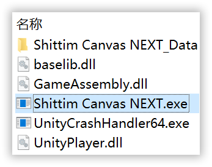

# Patch package {#patch-package}

App-only update—characters not included.

Patches look like **`[补丁] Shittim Canvas NEXT (xxxxxxxxxxx).zip`** and contain **only** the application files.

To apply:

1. In your existing `Shittim Canvas NEXT` folder (name may differ), **delete everything except** the **`Core Files`** folder.
2. Extract the patch **into** that same folder so new files sit **next to** `Core Files`. If Windows asks about conflicts, **overwrite**—configs may have moved forward.

